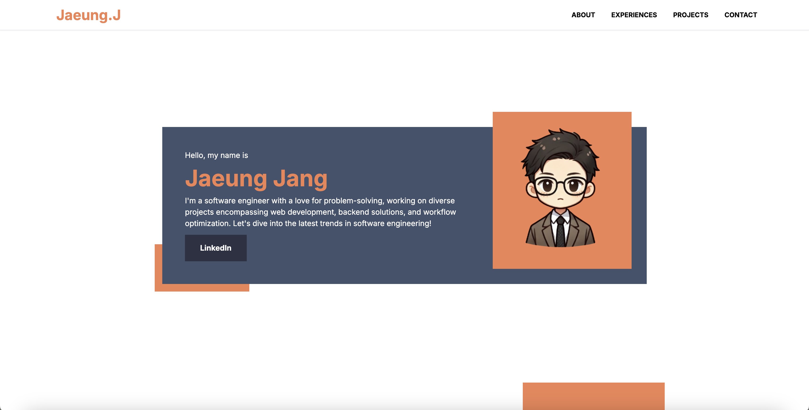

## jang.jaeung.com
This is a personal website that is built with mostly Next.js and Tailwind CSS.

## Tools
* [Next.js](https://nextjs.org/)
* [Tailwind CSS](https://tailwindcss.com/)
* [DaisyUI](https://daisyui.com/)
* [React Icons](https://react-icons.github.io/react-icons/)

## Color Reference
| Color     | Hex    |
|-----------|--------|
| primary   |#2e3f5b |
| secondary |#ef8354 |
| tertiary  |#2d3142 |

## Credit
To start this project, I researched on other people's website for references, especially people with similar background as me, software engineer. There were tons of good references out there and all of them were amazing, but one I liked and inspired a lot is [Brittany Chiang's website](https://brittanychiang.com/). The message is clear and concise, and I love her simplistic design as well. huge thanks for great inspiration, Thank you.